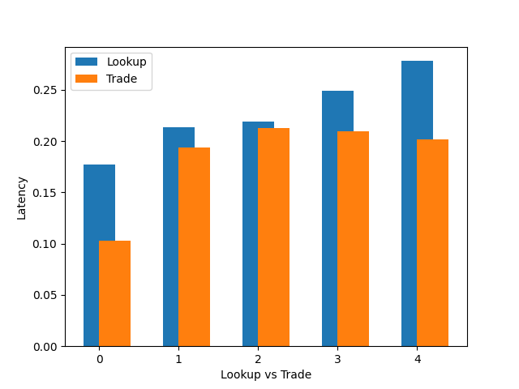
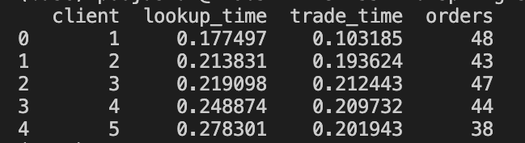
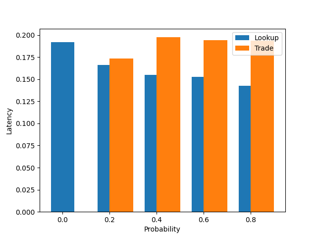
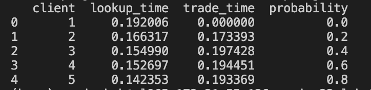
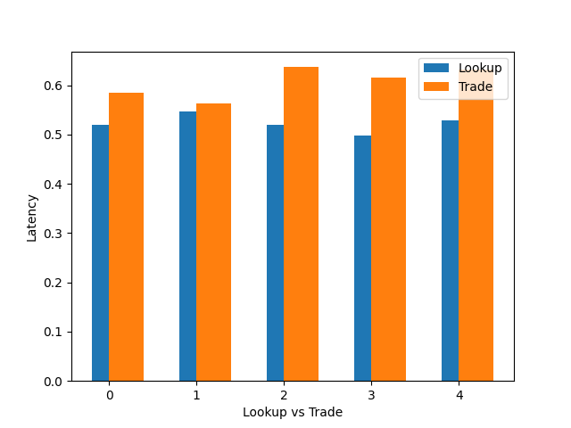
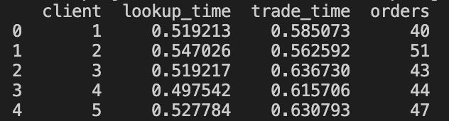

# Evaluation Document

- The application was hosted in an AWS EC2 instance and queried with 5 local clients. Steps for installing the application are provided in the README-instructions-on-how-to-run file.

### Graph for lookup and trade latency for 5 clients with caching

### Table for lookup and trade latency for 5 clients with caching with amount of orders

### Observation
- The graph shows the lookup latency and trade latency for each of the 5 clients when they were run concurrently.
- One surprising observation was that the lookup times were on average larger than the trade times. This was unexpected because the trade call required more calls between services than Lookup. For lookup, all that was required was a call to the Catalog Service, whereas for Order the Frontend had to make a call to the Order service who then made a call to the Catalog service.
- An explanation for why lookup times were higher was in the way the client sessions were structured: each trade request used the same connection that was established by the lookup requeset. This time saved on first establishing the connection must have been what reduced the latency for trade requests.
- In addition, it was noticeable that the clients that were started later (even a few seconds later) had a slightly higher average latency for both lookup and trade. This is possibly because there was more blocking between the requests as the clients competed for shared resources such as the order_log and the data file, which were accessed by holding a lock to prevent race conditions.

### Graph for lookup and trade latency for different probabilities with caching

### Table for lookup and trade latency for 5 clients with caching with amount of orders

### Observation
- Here we see how the probability of trade affects average lookup time and trade time for 1000 requests, with caching on.
- The lookup time on average decreases as the number of trade requests increases, which is very surprising. I would have expected the lookup time to be lower for low probabilities since fewer orders meant the cache was refreshed less often, leading to more direct cache hits instead of calls to the catalog.
- Trade times increase a bit but stay about the same, since each trade has the same latency involved with calls to the Order service, the Catalog, and a further call to the Frontend to update the cache. 

### Graph for lookup and trade latency for 5 clients without caching

### Table for lookup and trade latency for 5 clients without caching with amount of orders

### Observation
- Here, we did the same experiment as before but with caching off. 
- As expected, the lookup time stays more or less constant as the probability of trade increases. With caching off, every lookup request follows the same route of querying the catalog for responses. 
- Trade also stays more or less the same, with a slight increase. Caching plays no part in how the trade query is executed.

## Simulating Crash Failures.

- Using the docker command line, I was able to simulate crash failures by shutting down one of the Order replica containers and observing the application behavior.
- At first, it was obvious to the client when one of the services was down because the timeout time was too large (about 4 to 5 seconds). If the leader crashed, then both the first failed Order call by the leader and the subsequent ping to the shutdown leader replica contributed to the increased latency of the API call. Moreover, every time the new leader tried to propagate an order_log to the other replicas, it would wait the full timeout duration. This was fixed by decreasing the timeout duration to about 0.5 seconds, which made replica crashes far less perceptible to the client.
- Replica crashes occurred in one of two ways
    - A replica other than the leader crashed. In this case the application would mostly function as usual, with only the propagate calls by the leader timing out for that replica.
    - The leader crashed. In this case, the first call by the frontend service would trigger a new leader election and one of the live replicas would become the leader
- All replicas ended up with the exact same log entries even if they crashed for some period, as long as they were eventually brought back.
    - With no crashes, the leader made a `Propagate` call to every other replica which ensured that the same log entries were present in every relica.
    - If one of the replicas crashed and was later brought back to life, it would make a `FetchNewOrders` call by providing its own last transaction number and asking the leader to provide all the other transactions that happened since then. It would then store this data in its log file and continue functioning as though it never crashed. Access to the log file would be locked while the leader provided the replica with the new orders- this would ensure that the replica would not miss the orders that were executed while the `FetchNewOrders` query was being executed.