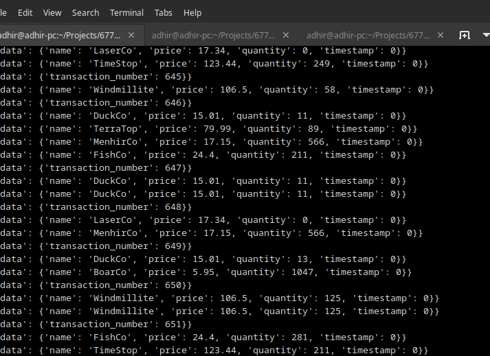
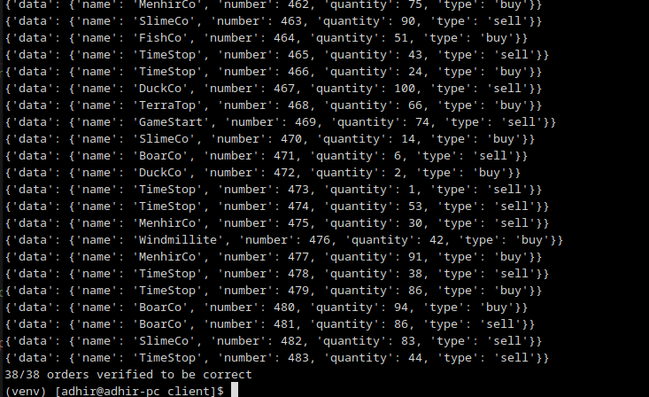
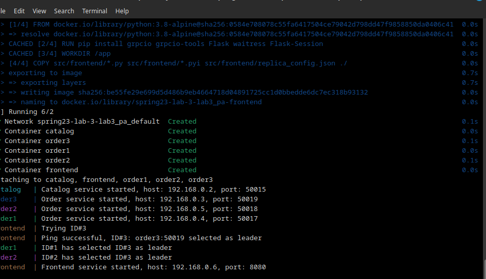
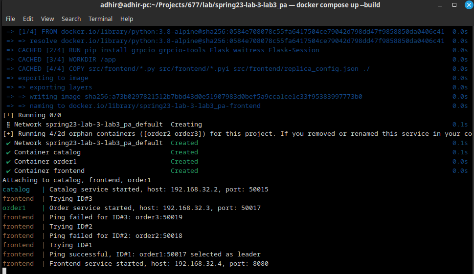
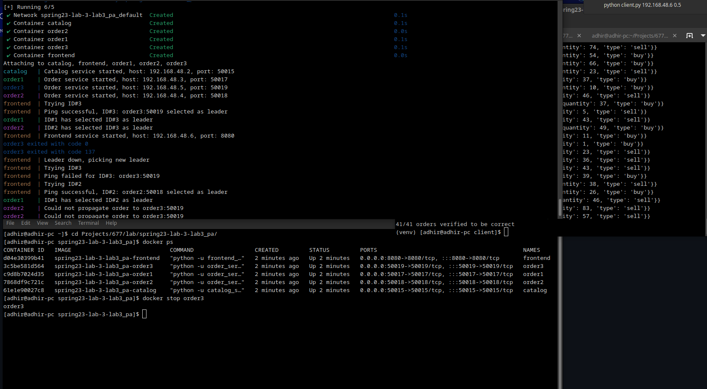
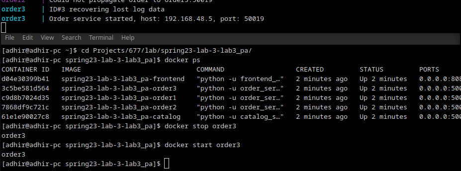

# Output of running the code

## 1) Lookup and Trade Requests

## 2) Order Verify Requests

## 3) Leader Election with 3 replicas

## 4) Leader Election with 2 replicas down

## 5) Leader Failure and re-election

## 6) Replica recovering log data

