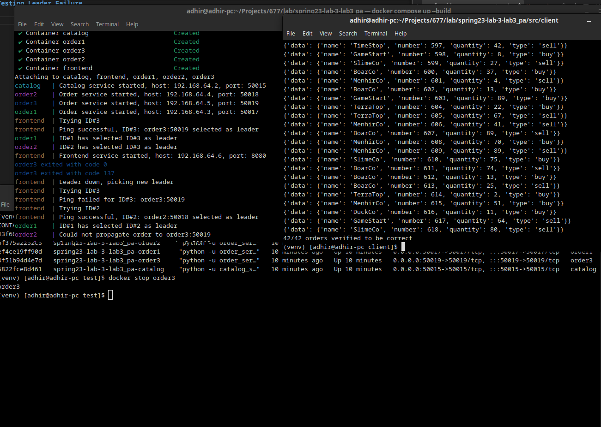
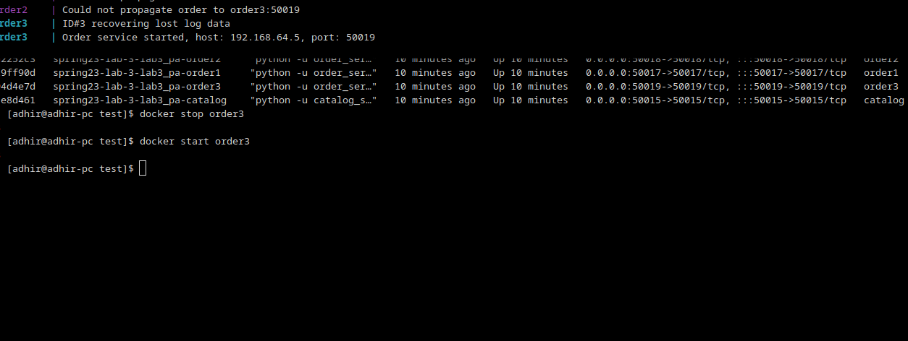

## Testing Leader Failure

## Testing Log Propagation to other replicas

# Testing Log file recovering after crash

## Frontend confirms log recovery occurred 

## Log data is recovered from leader

## Observation

We tested fault tolerance by killing the leader while the client was running. We noticed that once the leader was killed, a new leader was picked. The client did not know anything about this failure. As you can under the testing file propogation to the other replicas, all the order logs had the same information, which means that the replica which had a failure was also updated to the current order logs through the leader. We can observe this at the front-end.